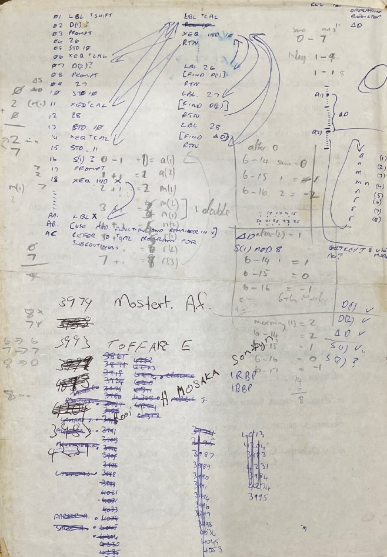
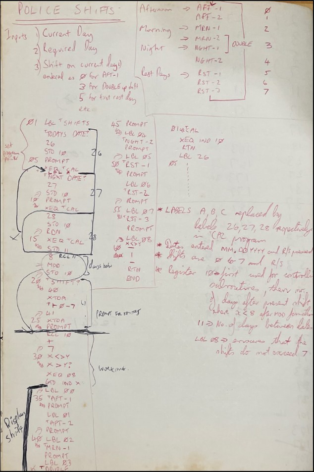
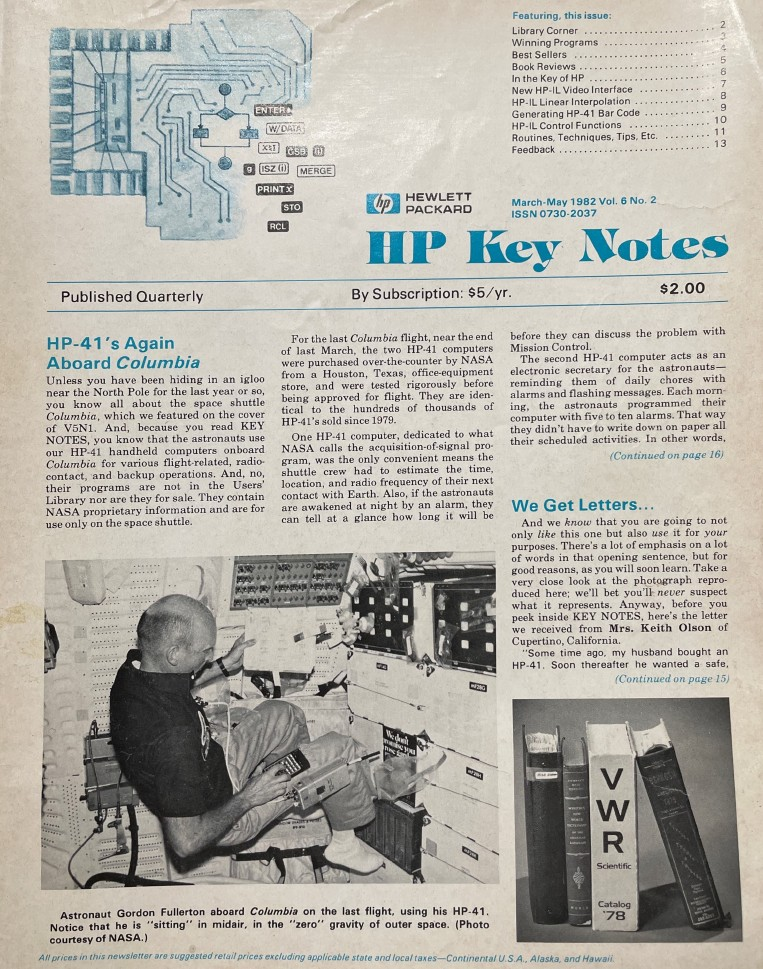

# HP41 Shifts Application

# Background
This was my first application written for work, back around 1987 or 1988, on a HP41CV programmable calculator. The problem it was solving, was for shift workers to be able to know what shift they'd be working on a future date such as Christmas Day, News Year's Eve, their birthday, etc. This was pretty important so they could arrange their social activities around whether they'd be working, or whether they'd have the whole day off.

Having written this program back then (before anyone had personal computers at home, a smartphone or Google, meant I was the go-to person to get this information really quickly. So when my work was starting to establish a computer unit in Cape Town, my then boss summoned me in, and basically said I was on my way to join the computer unit. And the rest, as they say, was history...

# What it does
* Prompt for today's date. Enter in mm.ddyyyy format.
* Calls Cal app that calculates Julian Day for the date.
* Prompt for a future date. Enter in mm.ddyyyy format.
* Calls Cal app that calculates Julian Day for that date.
* Works difference between days to give delta days.
* Uses MOD 8 to get remainder of division by day cycle of shift.
* Prompt for today's shift number 0-7.
** Shifts are numbered 0=Aft-1, 1=Aft-2, 2=Mrn-1, 3=Double(Mrn-2+Nght-1), 4=Nght-2, 5=Rst-1, 6=Rst-2, 7=Rst-3
* Adds delta days to shift number to get future shift, and displays shift my name.

# Comment
* Coming off a Sinclair ZX-81 and Commodore-64 running BASIC, I'd really not yet grasped proper modulisation and error checking. So I've left it pretty well much as it was back then.
* I did however remove the XTOA function which displayed brackets in the prompts, mainly because that would have required the Extended Functions module to be installed (which I had on my own calculator).
* For some odd reason the Cal routine was not expanded in my handwritten notes, so I thought I was calling some extended function that came with another module. But I could find no trace of such a function. Whilst I could have just used the DDAYS function (HP41CX has it built in) to work out the difference between the two dates, that would also have meant the Time Module needed to be installed. So to keep it basic HP41C compatible, I decided to make the Cal routine just calculate the Julian Day from the date instead. You can try that out by typing a mm.ddyyyy date into the X register (display), and then 'XEQ Cal' and you'll see it returns the correct Julian Day as an integer.
[]
[]

# The HP41CV
Yes still my absolute pride and joy, just no longer in daily use. Not only did it get me my IT job, but it set me on a path too that led me to be able to retire early. Hewlett-Packard made extremely well engineered calculators that in the early years of space travel, used to accompany astronauts as a manual backup system to assist them with manual landings of the space craft.

[]

Mine still works 100% after 40 years. You can also see a video of me powering my HP41CV up, from cold witha  new set of batteries, when it was 30 years old.

